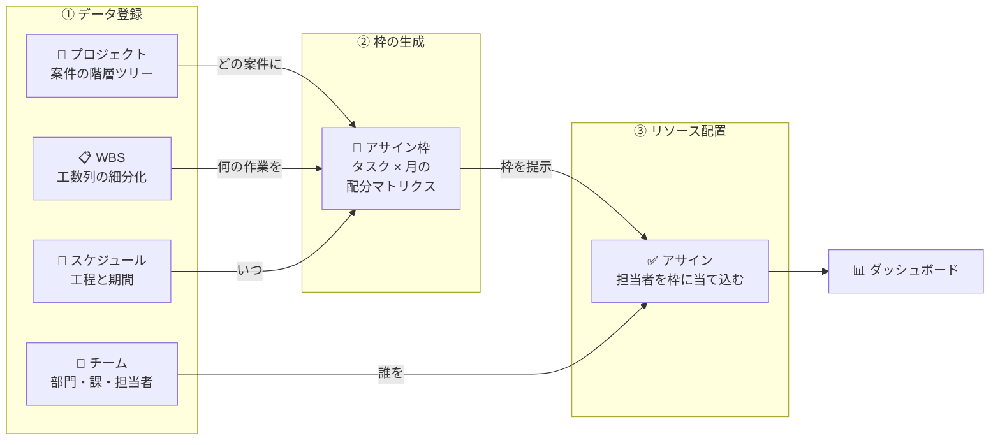

# リソース配分管理ツール

年度単位（4月〜翌年3月）で案件別・担当者別に月次リソース配分を管理するWebアプリケーション。データはlocalStorage（JSON）で永続化。

## コンセプト

本ツールは「**枠を作ってから、リソースを当て込む**」という考え方で設計されています。



| ステップ | 操作 | 目的 |
|---------|------|------|
| **① チーム** | 部門・課・担当者を登録する | 配置可能な「リソース」を定義する |
| **② プロジェクト** | 案件を階層ツリーで作成する | 作業の「枠」を定義する |
| **③ WBS** | 枠ごとに工数列を細分化する | 枠の中身を具体化する |
| **④ スケジュール** | 工程と期間を設定する | 枠に「いつ」の概念を加える |
| **⑤ アサイン** | 担当者を月次で枠に配分する | リソースを枠に当て込む |

これにより、ダッシュボードで稼働率・充足率を俯瞰し、リソースの過不足を可視化できます。

## 主な機能

- **案件管理** - 最大5階層のツリー構造、コード自動採番
- **担当者管理** - 所属・役割によるマスター管理
- **リソース配分** - 月次工数配分（0.0〜1.0人月、0.1刻み）のグリッド入力
- **レポート** - 稼働率チャート、担当者別/案件別サマリ、CSVエクスポート
- **ダークモード** - システム設定に連動

## 技術スタック

| カテゴリ | 技術 |
| --- | --- |
| フレームワーク | React 19 + TypeScript + Vite 7 |
| スタイル | Tailwind CSS 4 + shadcn/ui |
| 状態管理 | Zustand 5 / React Query 5 |
| フォーム | React Hook Form + Zod |
| グリッド | AG Grid |
| チャート | Recharts |
| ルーティング | React Router DOM 7 |
| テスト | Vitest 4 + Testing Library + Playwright |
| リンター | Biome |

## セットアップ

Node.js 20以上が必要です。

```bash
npm install
npm run dev
```

## コマンド一覧

| コマンド | 説明 |
| --- | --- |
| `npm run dev` | 開発サーバー起動（HMR） |
| `npm run build` | 型チェック + 本番ビルド |
| `npm run lint` | Biome Lint |
| `npm run format` | Biome Format |
| `npm run check` | Biome Check（Lint + Format） |
| `npm run test` | Vitest（watchモード） |
| `npm run test:run` | テスト一回実行 |
| `npm run test:coverage` | カバレッジ付きテスト |
| `npm run e2e` | Playwright E2Eテスト |
| `npm run preview` | 本番ビルドプレビュー |

## ディレクトリ構成

```text
src/
├── features/           # 機能別モジュール（Feature-Sliced Design）
│   ├── projects/       # 案件管理（階層ツリー + WBS）
│   ├── members/        # 担当者管理
│   ├── assignment/     # アサイン管理（タスク×担当者の月次配分）
│   ├── schedule/       # スケジュール管理（ガントチャート）
│   ├── team/           # チーム管理（組織階層・売上予算）
│   ├── tech-tags/      # 技術タグ管理
│   ├── dashboard/      # ダッシュボード
│   └── reports/        # レポート・スナップショット
├── shared/             # 共通コンポーネント・型定義・ユーティリティ
├── infrastructure/     # ストレージ・バリデーション
├── stores/             # Zustand ストア
├── lib/                # 汎用ヘルパー
└── App.tsx
```
