# Project Configuration

> **人間が記入するプロジェクトパラメータファイル。**
> 技術選定・品質基準・ポリシーなど「人間が決定すべき事項」をここに集約する。
>
> **AI が管理する領域（このファイルに含めない）:**
> - ルーティング定義 → `docs/project.md` にAIが自動生成・更新
> - ストア一覧 → `docs/project.md` にAIが自動生成・更新
> - データモデル/スキーマ → `docs/data-model.md` にAIが自動生成・更新
>
> **AI によるメンテナンス:**
> 各スキル（`/implementing-features`, `/plan` 等）は設計・実装の進行に伴い、
> このファイルのセクション11（既知の落とし穴）やセクション2（技術スタック）を
> 必要に応じて更新し、`docs/` 配下との整合性を保つ。

---

## セクション別の導入ガイド

**すべてを一度に記入する必要はない。** 使いたいスキルに応じて段階的に記入する。

```mermaid
flowchart LR
    subgraph MINIMAL["ミニマル（§1+§2+§3）"]
        S1["§1 基本情報"]
        S2["§2 技術スタック"]
        S3["§3 コマンド"]
    end

    subgraph RECOMMEND["推奨（+§4）"]
        S4["§4 アーキテクチャ"]
    end

    subgraph FULL["フル（+残り）"]
        S5["§5 データ永続化"]
        S6["§6 品質基準"]
        S7["§7 デザインシステム"]
        S8["§8 E2Eテスト環境"]
        S9["§9 Gitポリシー"]
        S10["§10 セキュリティ"]
        S11["§11 注意事項"]
        S12["§12 プラグイン"]
    end

    MINIMAL -- "+§4を追記" --> RECOMMEND
    RECOMMEND -- "必要に応じて" --> FULL
```



| 段階 | 記入セクション | 利用可能になるスキル・機能 |
| --- | --- | --- |
| **ミニマル** | §1 + §2 + §3 | `/prd`, `/plan`, `/code-review` — 設計・分析・レビュー |
| **推奨** | + §4 | `/architecture`, `/implementing-features`, `/refactoring`, 全チーム — 実装・リファクタリング |
| **フル** | 必要なセクションを追記 | `/security-scan`(§10), `/legal-check`, `/e2e-testing`(§8), `/performance` 等 |

> **§6（品質基準）** はTDD・カバレッジ目標・品質ゲートの有効化に使用する。スキルの前提条件ではないため空欄でも動作するが、記入すると品質管理が自動化される。
>
> **未記入のセクション** はスキル実行時にスキップされる。エラーにはならない。

---

## 1. プロジェクト基本情報 <!-- 必須 -->

| 項目           | 値                                   |
| -------------- | ------------------------------------ |
| プロジェクト名 | Resource Planner（package 名: resource-manager） |
| 概要           | リソース計画・稼働スケジューリング管理アプリ（Gantt チャート・データグリッド・ドラッグ&ドロップによる計画編集） |
| 対応言語       | ja                                   |
| Node.js要件    | 20 以上（@types/node 24 系で開発）   |

---

## 2. 技術スタック <!-- 必須 -->

<!-- プロジェクトで使用する技術を記入。AIが開発中にバージョン変更を追記する。 -->

| カテゴリ         | 技術                                          |
| ---------------- | --------------------------------------------- |
| フレームワーク   | React 19, TypeScript 5.9, Vite 7              |
| スタイリング     | Tailwind CSS 4, Radix UI, class-variance-authority, tailwind-merge, lucide-react |
| 状態管理         | Zustand 5（+ persist）, TanStack Query 5      |
| バリデーション   | Zod 3, react-hook-form 7（@hookform/resolvers）|
| ルーティング     | React Router DOM 7                            |
| アイコン         | lucide-react                                 |
| コード品質       | Biome 2.x                                    |
| 依存方向チェック | dependency-cruiser 17                        |
| Git Hooks        | husky 9, lint-staged 16                       |
| テスト           | Vitest 4, Playwright 1.5x, Testing Library, MSW 2, jsdom |

> ドメイン UI: ag-grid 33（データグリッド）, @svar-ui/react-gantt（ガント）, recharts（チャート）,
> react-dnd（D&D）, react-joyride（オンボーディング）, cmdk（コマンドパレット）。

---

## 3. コマンド <!-- 必須 -->

<!-- プロジェクトの開発・テスト・ビルドコマンドを記入 -->
<!-- `<pm>` をプロジェクトのパッケージマネージャーに置き換えること -->

**パッケージマネージャー参考:**

| ツール | 実行コマンド | インストール | 備考 |
| --- | --- | --- | --- |
| npm | `npm run` | `npm install` | Node.js 標準 |
| yarn | `yarn` | `yarn` | yarn は `run` 省略可 |
| pnpm | `pnpm run` | `pnpm install` | ディスク効率が高い |
| bun | `bun run` | `bun install` | 高速な代替ランタイム |

<!-- パッケージマネージャー: npm -->

```bash
npm run dev              # 開発サーバー (vite)
npm run build            # 本番ビルド (tsc -b && vite build)
npm run lint             # リント (biome lint .)
npm run format           # フォーマット (biome format --write .)
npm run check            # 一括チェック+修正 (biome check --write .)
npm run test             # テスト (vitest, watch)
npm run test:run         # テスト一回実行
npm run test:coverage    # カバレッジ付きテスト
npm run e2e              # E2Eテスト (playwright test)
npm run e2e:ui           # E2E UI モード
npm run depcruise        # 依存方向チェック (dependency-cruiser)
```

---

## 4. アーキテクチャ <!-- 推奨 -->

### 4.1 パターン

<!-- プロジェクト規模に合わせてパターンを選定する。以下のガイドを参考に記入。 -->

**パターン選定ガイド:**

| 規模 | チーム | 推奨パターン | 特徴 |
| --- | --- | --- | --- |
| MVP・小規模 | 1-2名 | シンプル構成 | フラットで学習コスト低。素早く立ち上げ可能 |
| 中規模 | 2-5名 | モジュラー/Feature-Based | 機能単位で分離。FSDほど厳格でなく柔軟 |
| 大規模・長期運用 | 5名以上 | FSD（Feature-Sliced Design） | 厳格なレイヤー制約。大規模チームの秩序を維持 |
| Next.js / Nuxt | — | Pages-Based | ファイルシステムルーティングに準拠 |

選定パターン: <!-- 例: シンプル構成 / モジュラー / FSD / Pages-Based -->

### 4.2 パスエイリアス

<!-- 例: `@/` → `src/` -->

### 4.3 ディレクトリ構成（概要）

<!-- ソースコードのディレクトリ構成を記入。詳細は docs/architecture.md にAIが生成する。 -->
<!-- §4.1で選定したパターンに合わせて記入する。下の折りたたみにパターン別の具体例あり。 -->

```text
src/
├── <!-- プロジェクトのディレクトリ構成を記入 -->
```

### 4.4 依存方向ルール

<!-- プロジェクトの依存方向ルールを記入。検出コマンドも記載する。 -->
<!-- §4.1で選定したパターンに合わせて記入する。下の折りたたみにパターン別の具体例あり。 -->

- <!-- 依存方向ルールを記入 -->
- 循環依存: 禁止
- 検出コマンド: <!-- 例: `npx depcruise src --config` / なし -->

---

<details>
<summary>📁 パターン別ディレクトリ構成・依存方向ルールの具体例（クリックで展開）</summary>

#### A. シンプル構成 — MVP・小規模向け

フラットに `components/hooks/utils` を配置。機能が増えたらモジュラーへ移行。

```text
src/
├── main.tsx               # エントリーポイント
├── App.tsx                # ルーティング定義
├── components/            # UIコンポーネント
├── hooks/                 # カスタムフック
├── utils/                 # ユーティリティ関数
├── types/                 # 型定義
├── stores/                # 状態管理
└── test/                  # テストセットアップ
```

依存方向ルール例:
- `utils` → `components`: 禁止（utils は純粋関数のみ）
- `stores` → `components`: 禁止
- 循環依存: 禁止

#### B. モジュラー/Feature-Based — 中規模向け

機能（feature）単位で自己完結するモジュール構成。FSDほど厳格でなく柔軟。

```text
src/
├── main.tsx               # エントリーポイント
├── App.tsx                # ルーティング定義
├── features/              # 機能モジュール（各featureが自己完結）
│   ├── auth/              #   認証（components, hooks, utils, types）
│   ├── dashboard/         #   ダッシュボード
│   └── settings/          #   設定
├── shared/                # 機能横断の共有コード
│   ├── components/        #   共有UIコンポーネント
│   ├── hooks/             #   共有フック
│   └── utils/             #   共有ユーティリティ
├── stores/                # グローバル状態管理
└── test/                  # テストセットアップ
```

依存方向ルール例:
- `features/X` → `features/Y` の直接依存: 禁止（shared経由で連携）
- `shared` → `features`: 禁止
- `stores` → `features`: 禁止
- 循環依存: 禁止

#### C. FSD（Feature-Sliced Design） — 大規模・長期運用向け

厳格なレイヤー制約と依存方向制御。大規模チームでの秩序維持に適する。

```text
src/
├── main.tsx               # エントリーポイント
├── App.tsx                # ルーティング定義
├── features/              # 機能モジュール
├── shared/                # 共有レイヤー
├── infrastructure/        # インフラ層（API通信・外部サービス）
├── stores/                # 状態管理
├── test/                  # テストセットアップ
└── lib/                   # 汎用ユーティリティ
```

依存方向ルール例:
- `features/X` → `features/Y` の直接依存: 禁止（shared経由で連携）
- `shared` → `features`: 禁止
- `infrastructure` → `features`: 禁止
- `stores` → `features`: 禁止
- 循環依存: 禁止
- 検出コマンド: `npx depcruise src --config`

#### D. Pages-Based — Next.js App Router / Nuxt 向け

ファイルシステムがルーティングを担う構成。フレームワーク規約に準拠。

```text
src/  # または app/（Next.js App Router）
├── app/                   # ルーティング（App Router）
│   ├── layout.tsx         #   ルートレイアウト
│   ├── page.tsx           #   トップページ
│   ├── dashboard/         #   /dashboard
│   └── settings/          #   /settings
├── components/            # UIコンポーネント
├── hooks/                 # カスタムフック（use-client）
├── lib/                   # ユーティリティ・API関数
├── stores/                # クライアント状態管理
└── types/                 # 型定義
```

依存方向ルール例:
- Server Components → Client Components: 可（逆は禁止）
- `lib` → `components`: 禁止
- `stores` → `components`: 禁止
- 循環依存: 禁止

</details>

---

## 5. データ永続化 <!-- 任意 -->

| 項目               | 値                                             |
| ------------------ | ---------------------------------------------- |
| 戦略               | <!-- 例: localStorage / IndexedDB / REST API -->|
| ストレージキー     | <!-- 例: `app-data`（業務データ）-->            |
| マイグレーション方針 | <!-- 例: optional + デフォルト値で後方互換 --> |

---

## 6. 品質基準 <!-- 推奨 -->

| 項目                 | 値         |
| -------------------- | ---------- |
| テストカバレッジ目標 | 80%（暫定・要調整） |
| TDD                  | yes |
| 品質ゲート           | yes |
| ツール出力先         | `testreport/` |
| サマリー出力先       | `output/reports/` |

### 6.1 レポート出力構成

レポートは用途に応じて2つのディレクトリに分離する:

- `testreport/` — ツールが生成する生データ（HTML/JSON/LCOV等）。`.gitignore`に追加すること
- `output/reports/` — 人間がレビューするMarkdownサマリー。Gitで管理する

```text
testreport/                    ← ツール直接出力（.gitignore対象）
├── coverage/              # ユニットテストカバレッジ（HTML/LCOV）
├── e2e/                   # Playwright E2Eテストレポート・トレース
└── security/              # セキュリティスキャンレポート（JSON/HTML）

output/reports/                ← 人間向けサマリー（Git管理）
├── review/                # コードレビュー結果
├── test/                  # テスト結果サマリー
├── security/              # セキュリティスキャンサマリー
└── legal/                 # 法務チェック結果
```

---

## 7. デザインシステム <!-- 推奨 -->

| 項目                       | 値                                         |
| -------------------------- | ------------------------------------------ |
| 参照するデザインシステム   | <!-- URL or 「なし」 -->                   |
| UIコンポーネントライブラリ | <!-- 例: shadcn/ui（Radix UI）-->          |
| アイコンライブラリ         | <!-- 例: Lucide Icons -->                  |
| アクセシビリティ基準       | <!-- 例: WCAG 2.1 AA -->                   |
| カラートークン定義ファイル | <!-- 例: src/index.css -->                 |

---

## 8. E2E テスト環境 <!-- 任意 -->

| 項目                 | 値                              |
| -------------------- | ------------------------------- |
| ブラウザ             | <!-- 例: Chromium -->           |
| ベースURL            | <!-- 例: http://localhost:5173 -->|
| テストファイル配置   | <!-- 例: e2e/ -->               |
| テストデータ注入方式 | <!-- 例: localStorage直接注入 -->|

---

## 9. Git ポリシー <!-- 任意 -->

| 項目           | 値                                           |
| -------------- | -------------------------------------------- |
| pre-commit     | <!-- 例: lint-staged（Biome check）-->       |
| pre-push       | <!-- 例: lint + 型チェック + テスト -->       |
| `--no-verify`  | 禁止                                         |
| `--force`      | 原則禁止                                     |

---

## 10. セキュリティポリシー <!-- 任意 -->

<!-- プロジェクトのセキュリティポリシーを記入 -->

- ユーザー入力は必ずバリデーション
- 依存パッケージの脆弱性は定期確認
- <!-- その他プロジェクト固有のポリシーを追記 -->

### ハーネス側の安全機構(本テンプレート提供)

- **3 層防御**: フック(Layer 1) → deny ルール(Layer 2) → allow ルール(Layer 3)。詳細は `@.claude/guardrails.md`
- **Self-SAST**: `scan-harness.sh`(PreToolUse: Skill)が secret 混入 / constitution 改竄 / settings.local の deny 弱体化を検出
- **不変原則**: `@constitution.md` の 7 原則が `.claude/.constitution.sha256` で hash 監視される
- **Hook profile**: `BLUEPRINT_HOOK_PROFILE=minimal|standard|strict` で検査の厳しさを切替可能
- **高リスク skill 抑止**: `deploy*` 系 skill は `scan-harness.sh` で常時ブロック(profile=minimal でのみ通過)
- **3 階層 permission 運用**: allowlist / auto / sandbox の使い分けは `@.claude/permissions-guide.md` 参照

---

## 11. プロジェクト固有の注意事項 <!-- 推奨 -->

> このセクションはAIが開発中に発見した問題を追記・更新する。
> 人間が初期値を記入してもよい。

### 既知の落とし穴

<!-- 開発中に発見された問題・注意点をAIが追記する。初期値として既知の問題があれば記入。 -->

| 問題 | 原因 | 対策 |
| ---- | ---- | ---- |
| <!-- 問題の概要 --> | <!-- 根本原因 --> | <!-- 対策 --> |

### フレームワーク固有パターン

<!-- 使用するフレームワーク・ライブラリ固有の注意点を記入。AIも追記する。 -->

---

## 12. Claude Code プラグイン設定 <!-- 任意 -->

<!-- 使用するプラグインを記入。不要なものは削除する。 -->

| プラグイン        | 有効 | 用途                                       |
| ----------------- | ---- | ------------------------------------------ |
| context7          | yes  | ライブラリドキュメント参照                 |
| playwright        | yes  | E2Eテスト実行・デバッグ                    |
| draw.io           | yes  | アーキテクチャ図・フロー図作成             |
| pr-review-toolkit | yes  | GitHub PR連携                              |
| sentry            | no   | 本番エラー調査（必要に応じて有効化）       |

---

## 13. モデル選定戦略 <!-- 推奨 -->

> Claude Opus / Sonnet / Haiku のどれを、どのスキル・チーム・エージェントで使うか。
> コスト・品質・速度のトレードオフを明示する。未記入時はセッション既定モデルにフォールバック。

### 13.1 Tier 定義

| Tier | モデル（2026-04 時点） | 用途 | コスト感 |
| ---- | ---------------------- | ---- | -------- |
| **Critical** | `claude-opus-4-7` | アーキテクチャ判断・セキュリティ監査・複雑なリファクタリング | 高 |
| **Complex** | `claude-sonnet-4-6` | 設計・実装・コードレビュー・E2E 作成 | 中（推奨） |
| **Operational** | `claude-haiku-4-5-20251001` | 探索・ドキュメント同期・軽量な繰り返し作業 | 低 |

> **モデル ID の注記**: Opus 4.7 / Sonnet 4.6 はエイリアス（Anthropic 側で最新バージョンに自動更新される）。Haiku は具体的な日付付きバージョン ID。エイリアスが将来的に廃止される可能性があるため、本番運用では日付付き ID への固定を検討する。最新・正確な ID は [Anthropic Console の Models 一覧](https://console.anthropic.com/settings/models) で確認。

旧モデル（`claude-opus-4`, `claude-sonnet-3-5`, `claude-haiku-3-5` 等）は本テンプレートでは非推奨。

### 13.2 スキル × モデル推奨マッピング

| スキル | 推奨 Tier | 根拠 |
| ------ | --------- | ---- |
| `/prd` | Complex | 要件構造化。推論量は中程度 |
| `/architecture` | Critical | システム設計の判断ミスが後工程に波及 |
| `/plan` | Complex | タスク分解・依存関係把握 |
| `/implementing-features` | Complex | TDD 実装の主力 |
| `/ui-ux-design` | Complex | デザインシステム準拠判断 |
| `/hig-compliance` | Complex | 画面間整合性の横断判定 |
| `/design-system-audit` | Complex | 比率・トークン計算 |
| `/code-review` | Critical | 指摘の質が品質を左右 |
| `/security-scan` | Critical | 脆弱性見逃しの影響大 |
| `/legal-check` | Complex | ライセンス・GDPR の条文照合 |
| `/e2e-testing` | Complex | Page Object 設計・安定性 |
| `/performance` | Complex | 計測データ解釈 |
| `/refactoring` | Critical | 構造変更のリスク管理 |
| `/adr` | Operational | 定型フォーマット記録 |
| `/review-fix` | Complex | 指摘の意図を正しく汲む必要あり |

### 13.3 チーム × モデル推奨マッピング

| チーム | PJM | アナリスト | プランナー | 開発者 | レビュアー | テスター |
| ------ | --- | ---------- | ---------- | ------ | ---------- | -------- |
| `TEAM_PJM` | Critical | Complex | Complex | Complex | Critical | Complex |
| `TEAM_FEATURE` | — | — | Complex | Complex | Complex | Complex |
| `TEAM_QA` | — | — | — | — | Critical | Complex |
| `TEAM_PLANNING` | Critical | Complex | Complex | — | — | — |
| `TEAM_DESIGN` | — | Complex | — | Complex | Complex | — |
| `TEAM_REFACTOR` | — | — | Complex | Critical | Complex | Complex |

PJM（リーダー）は判断精度が重要なので Critical を推奨。
レビュアーは監査観点のズレが致命的なので Critical。

### 13.4 サブエージェント × モデル推奨マッピング

| agent | Tier | 理由 |
| ----- | ---- | ---- |
| `explorer` | Operational | Grep/Read の軽量反復 |
| `planner` | Complex | 影響範囲判断 |
| `security-reviewer` | Critical | 脆弱性見逃しの影響大 |
| `performance-analyst` | Complex | 計測データ解釈 |
| `doc-synchronizer` | Operational | 決定論的な差分更新 |
| `test-writer` | Complex | エッジケース網羅 |

### 13.5 コスト最適化の原則

1. **Operational を積極活用**: 探索・同期・定型生成は Haiku で十分。Opus を使う必要はない
2. **並行実行時はTier分散**: `TEAM_PJM --parallel` で全員 Opus にしない。役割に応じて Tier を混在
3. **Subagent は Haiku 優先**: 単発の委譲は軽量運用。必要に応じて Critical に昇格
4. **コスト上限を API キーに設定**: `@.claude/pitfalls.md` #6 参照
5. **月次使用量レビュー**: Anthropic Console で確認。想定と乖離したら Tier を見直す

### 13.6 未記入時の挙動

- フロントマター `model:` を省略した skill / agent はセッション既定モデルを継承
- 本セクションの表は**推奨値**であり、プロジェクト要件に応じてオーバーライド可能
- 個人設定で常に Opus を使いたい場合は `~/.claude/settings.json` の `model` で指定
